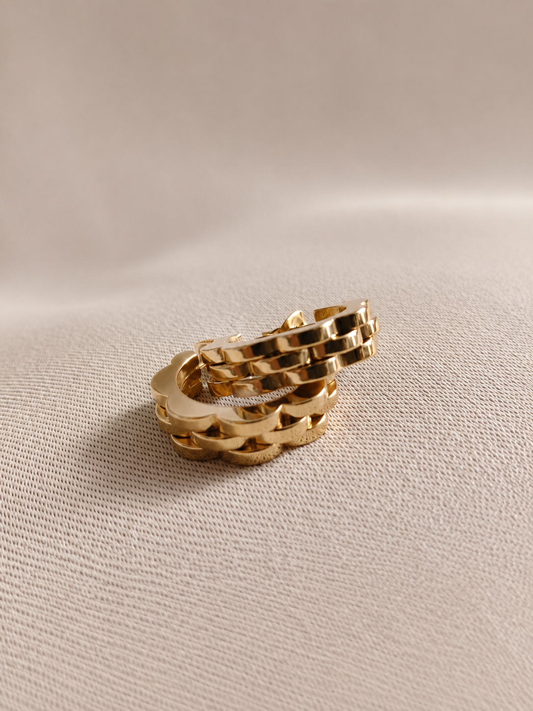

# AG Atelier

## Integrantes

- Paloma Lucas
- Elio Federico Chaile
- Mariano Torres Mari

## Descripción

**AG Atelier** es un sitio web desarrollado para un emprendimiento de joyería y accesorios de Santiago del Estero.

El sitio permite conocer el emprendimiento, visualizar productos organizados por categorías, agregar productos a un carrito y generar pedidos mediante WhatsApp.

También cuenta con una sección **Sobre Nosotros** y un formulario de contacto.

## Tecnologías utilizadas

- HTML5
- CSS3
- JavaScript
- Bootstrap 5.3.8
- Google Fonts
- Git
- GitHub

## ¿Dónde utilizamos Flexbox?

Flexbox se utilizó principalmente mediante las clases de Bootstrap para organizar y alinear diferentes elementos del sitio.

Se utilizó en:

- Navbar.
- Botones y enlaces.
- Tarjetas de productos.
- Alineación de precios y contenido.
- Carrito.
- Footer.
- Secciones responsive.

Algunas clases utilizadas fueron:

```text
d-flex
flex-column
flex-sm-row
flex-wrap
justify-content-center
justify-content-between
align-items-center
align-items-start
```

## ¿Dónde utilizamos Grid?

Utilizamos el sistema **Grid de Bootstrap** para organizar la estructura de las páginas y adaptar el contenido a distintos tamaños de pantalla.

Se utilizó principalmente en:

- Home.
- Sección de categorías.
- Productos destacados.
- Galería de productos.
- Sobre Nosotros.
- Equipo de desarrollo.
- Footer.

Por ejemplo, en la Galería:

```html
<div class="col-12 col-sm-6 col-lg-4 col-xl-3">
```

Esto permite que la cantidad de productos por fila cambie automáticamente dependiendo del tamaño de pantalla.

## Variables CSS

Creamos variables CSS para mantener centralizados los colores y tipografías principales del sitio:

```css
:root {
    --font-display: 'Cormorant Garamond', serif;
    --font-body: 'Jost', sans-serif;
    --color-bg: #fcf2e2;
    --color-black: #1A1A1A;
    --color-burgundy: #7A2430;
    --color-muted: #6B6156;
}
```

Estas variables permiten mantener una identidad visual consistente y facilitan futuros cambios de diseño.

## Responsive Design

El Responsive Design se implementó principalmente utilizando **Bootstrap** y sus diferentes breakpoints.

Utilizamos clases como:

```text
col-12
col-sm-6
col-md-4
col-lg-6
col-xl-3
text-center
text-lg-start
flex-column
flex-sm-row
p-4
p-md-5
```

Estas clases permiten que el contenido se adapte automáticamente según el tamaño de pantalla.

El sitio fue pensado para visualizarse correctamente en:

- Celulares.
- Tablets.
- Notebooks.
- Computadoras de escritorio.

También se utilizó:

```html
<meta name="viewport" content="width=device-width, initial-scale=1.0">
```

para asegurar una correcta adaptación en dispositivos móviles.

## Estrategias SEO implementadas

Se aplicaron distintas estrategias básicas de **SEO On-Page** para mejorar la estructura y la interpretación del sitio por parte de los motores de búsqueda.

### Meta etiquetas

Cada página incluye etiquetas dentro del `<head>` como:

```html
<meta name="description" content="...">
<meta name="keywords" content="...">
<meta name="robots" content="index, follow">
```

También se utilizaron títulos específicos para cada página:

```text
AG Atelier | Joyería y accesorios
Galería | AG Atelier
Sobre Nosotros | AG Atelier
```

### HTML semántico

Se utilizaron etiquetas semánticas para organizar correctamente el contenido:

```text
header
nav
main
section
article
footer
```

### Jerarquía de encabezados

Se mantuvo una jerarquía de títulos:

- `h1` para el título principal.
- `h2` para las secciones principales.
- `h3` para productos o contenido secundario.

### Texto alternativo en imágenes

Las imágenes incluyen atributos `alt` descriptivos.

Ejemplo:

```html

```

Esto mejora la accesibilidad y permite describir correctamente el contenido visual.

### Enlaces internos

Se implementaron enlaces internos hacia categorías específicas de la galería:

```text
galeria.html#pulseras
galeria.html#aritos
galeria.html#anillos
galeria.html#collares
galeria.html#maquillaje
```

Esto facilita la navegación entre contenidos relacionados.

### Responsive Design y SEO

El sitio utiliza Bootstrap y:

```html
<meta name="viewport" content="width=device-width, initial-scale=1.0">
```

para adaptarse correctamente a dispositivos móviles.

### Optimización de imágenes

En distintas imágenes se utilizó:

```html
loading="lazy"
```

para evitar cargar inmediatamente imágenes que todavía no se encuentran visibles en pantalla.
